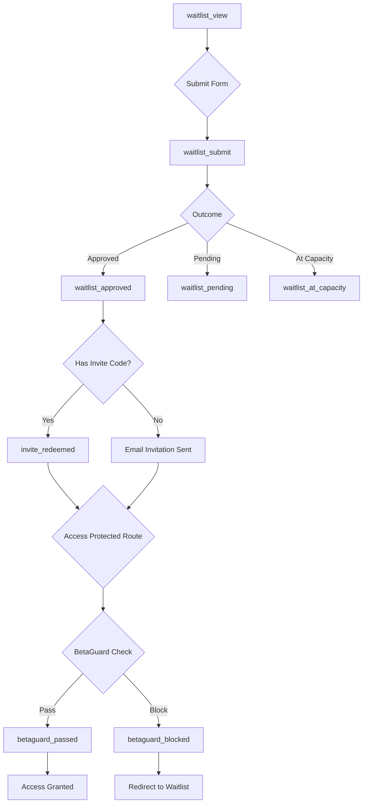

# Teed.club Event Map - Observability System

## Overview
This document maps the complete user journey through the Teed.club platform, tracking key events and identifying potential drop-off points in the conversion funnel.

## Event Flow Diagram



## Event Definitions

### 1. **waitlist_view**
- **Trigger**: User lands on /waitlist page
- **Properties**:
  - `source`: Referral source (e.g., 'direct', 'twitter', 'reddit')
  - `timestamp`: ISO timestamp
- **Purpose**: Track traffic sources and funnel entry

### 2. **waitlist_submit**
- **Trigger**: User submits waitlist form
- **Properties**:
  - `role`: User's selected role (golfer, fitter_builder, etc.)
  - `score`: Calculated priority score
  - `hasInvite`: Boolean if invite code provided
  - `city`: User's city/region
  - `outcome`: Result of submission ('approved' | 'pending' | 'at_capacity')
- **Purpose**: Track form completion and immediate outcomes

### 3. **waitlist_approved**
- **Trigger**: User is immediately approved for beta access
- **Properties**:
  - `email_hash`: SHA-256 hash of email for privacy
  - `score`: Priority score that led to approval
  - `timestamp`: ISO timestamp
- **Purpose**: Track successful instant approvals

### 4. **waitlist_pending**
- **Trigger**: User is placed on waitlist (not immediately approved)
- **Properties**:
  - `score`: Priority score
  - `position`: Position in waitlist queue
  - `timestamp`: ISO timestamp
- **Purpose**: Track users entering the waiting queue

### 5. **waitlist_at_capacity**
- **Trigger**: Beta is at capacity when user tries to join
- **Properties**:
  - `spots_filled`: Number of spots filled
  - `cap`: Total capacity limit
  - `timestamp`: ISO timestamp
- **Purpose**: Track when we're turning users away due to capacity

### 6. **invite_redeemed**
- **Trigger**: User successfully redeems an invite code
- **Properties**:
  - `success`: Boolean indicating if redemption worked
  - `code_hash`: Hash of the invite code (for tracking campaigns)
  - `timestamp`: ISO timestamp
- **Purpose**: Track invite code usage and success rate

### 7. **betaguard_blocked**
- **Trigger**: BetaGuard component blocks access to protected route
- **Properties**:
  - `route`: Path user was trying to access
  - `reason`: Why blocked ('no_beta_access' | 'not_authenticated' | 'beta_closed')
  - `timestamp`: ISO timestamp
- **Purpose**: Identify where users are hitting access walls

### 8. **betaguard_passed**
- **Trigger**: BetaGuard component allows access to protected route
- **Properties**:
  - `route`: Path user is accessing
  - `has_beta_access`: Boolean if user has beta flag
  - `public_beta_enabled`: Boolean if public beta is on
  - `timestamp`: ISO timestamp
- **Purpose**: Track successful access grants

## Drop-off Analysis Points

### Critical Drop-offs to Monitor:

1. **Form Abandonment**
   - Metric: `waitlist_view` → `waitlist_submit`
   - Expected Rate: 30-50% conversion
   - Action if Low: Simplify form, reduce required fields

2. **Approval to Activation**
   - Metric: `waitlist_approved` → `betaguard_passed`
   - Expected Rate: 60-80% activation
   - Action if Low: Improve onboarding emails, clearer CTAs

3. **Invite Redemption**
   - Metric: Invites sent → `invite_redeemed`
   - Expected Rate: 40-60% redemption
   - Action if Low: Better invite messaging, urgency/scarcity

4. **Beta Access Utilization**
   - Metric: `betaguard_passed` frequency per user
   - Expected: Multiple visits per week
   - Action if Low: Engagement campaigns, feature highlights

## Implementation Details

### Client-Side Tracking
```typescript
// EventTracker service with guardrails
import { getEventTracker } from '@/services/eventTracker';

const tracker = getEventTracker();

// Track with automatic PII protection and rate limiting
await tracker.track('waitlist_submit', {
  role: 'golfer',
  score: 85,
  hasInvite: true,
  city: 'Austin, TX',
  outcome: 'approved'
});
```

### Server-Side Processing
```typescript
// Analytics API endpoint
POST /api/analytics/track
{
  events: [{
    event_name: 'waitlist_submit',
    properties: { ... },
    session_id: 'uuid',
    user_id: 'uuid' // if authenticated
  }]
}
```

### Database Storage
```sql
-- Events stored in analytics_events table
INSERT INTO analytics_events (
  event_name,
  user_id,
  session_id,
  properties,
  created_at
) VALUES ( ... );
```

## Guardrails & Privacy

### PII Protection
- Email addresses are SHA-256 hashed before tracking
- IP addresses are stored separately with limited retention
- No passwords, SSNs, or payment info ever tracked
- Automatic field sanitization in EventTracker service

### Rate Limiting
- Client: Max 100 events/minute per session
- Server: Leaky bucket algorithm, 100 tokens/minute per IP
- Batch processing every 5 seconds to reduce API calls
- Failed events stored in localStorage for retry

### Error Handling
- Non-blocking: Analytics failures don't break app functionality
- Retry logic for network failures with exponential backoff
- Event validation before sending to prevent bad data
- Error boundary around all tracking calls

## Dashboard Metrics

### Key Performance Indicators (KPIs)

1. **Conversion Rate**
   - Formula: `waitlist_approved / waitlist_submit * 100`
   - Target: > 20% instant approval

2. **Activation Rate**
   - Formula: `betaguard_passed / waitlist_approved * 100`
   - Target: > 70% within 7 days

3. **Drop-off Rate by Step**
   - Identify biggest leaks in funnel
   - Focus optimization on highest drop-off

4. **Time to Activation**
   - Measure: `betaguard_passed.timestamp - waitlist_approved.timestamp`
   - Target: < 24 hours median

## Monitoring & Alerts

### Real-time Monitoring
- Dashboard refreshes every 5 minutes
- Materialized view for last 24 hours of activity
- Session tracking for user journey visualization

### Alert Conditions
1. Conversion rate drops below 15%
2. More than 50 `betaguard_blocked` events in 1 hour
3. No `waitlist_submit` events for 2+ hours during business hours
4. Error rate exceeds 5% of total events

## Future Enhancements

### Planned Events
- `equipment_added`: Track when users add equipment to bags
- `photo_uploaded`: Track photo contributions
- `badge_earned`: Track gamification engagement
- `affiliate_clicked`: Track monetization potential

### Advanced Analytics
- Cohort analysis by acquisition source
- A/B testing framework for conversion optimization
- Predictive scoring for churn risk
- Multi-touch attribution modeling

## Usage Examples

### Query Funnel Conversion
```sql
SELECT * FROM get_funnel_conversion(
  'waitlist_conversion',
  NOW() - INTERVAL '30 days',
  NOW()
);
```

### Get Drop-off Report
```sql
WITH funnel AS (
  SELECT * FROM get_funnel_conversion('full_journey')
)
SELECT 
  step_name,
  unique_users,
  LAG(unique_users) OVER (ORDER BY step_index) - unique_users AS users_lost,
  conversion_rate
FROM funnel;
```

### Track Custom Event
```typescript
import { trackEvent } from '@/services/eventTracker';

// With guardrails applied automatically
await trackEvent('custom_event', {
  category: 'engagement',
  action: 'clicked_cta',
  label: 'hero_banner'
});
```

## Maintenance

### Daily Tasks
- Review drop-off analysis dashboard
- Check for anomalies in conversion rates
- Monitor error logs for tracking failures

### Weekly Tasks
- Generate conversion funnel report
- Review and optimize highest drop-off points
- Clean up stale rate limit entries

### Monthly Tasks
- Analyze cohort performance
- Review and update event definitions
- Optimize database indexes for query performance
- Archive old event data (> 90 days)

---

*Last Updated: December 2024*
*Version: 1.0.0*